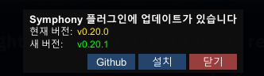

[한국어](README.ko.md) | [English](README.md)

# Symphony
`Symphony`는 `VALOFE` 의 게임 `LastOrigin` PC 클라이언트를 위한 [BepInEx](https://github.com/BepInEx/BepInEx) 플러그인입니다.
각종 사용자 편의 기능(QoL)을 제공하는 것을 목표로 하고 있습니다.

## 설치 방법
1. [BepInEx](https://github.com/BepInEx/BepInEx) 6의 **BepInEx-Unity.Mono-win-x64** 버전을  [다운로드 페이지](https://github.com/BepInEx/BepInEx/releases/tag/v6.0.0-pre.2)에서 다운로드합니다.
2. 압축 파일을 풀어 `LastOrigin.exe` 파일이 존재하는 설치 폴더에 붙여넣기 합니다.\
이 때, `winhttp.dll` 파일과 `LastOrigin.exe` 파일이 같은 폴더에 존재해야합니다.
3. `BepInEx` 폴더 내의 `plugins` 안에 `Symphony.dll` 을 넣습니다.

## 사용 방법
`F12` 키를 누르는 것으로 게임 화면에서 플러그인의 옵션들을 설정할 수 있습니다.

다음은 플러그인 내 각 기능별 설명입니다.

### QuickSetting
일부 인게임 설정을 간편하게 설정합니다.

### GracefulFPS
게임의 FPS 관련 기능을 제공합니다.

- 게임 FPS 수치 표시, 전체 및 전투 FPS 제한 기능을 제공합니다.\
  FPS는 `기본`, `고정`, `수직동기화` 옵션을 제공합니다.

### SimpleTweaks
게임의 각종 간단한 기능 개선 모음입니다.

- 로비 UI 숨기기 단축키 지정 기능을 제공합니다.
- 게임 창의 종횡비 고정 방지 및 창 크기 조정 후 위치 초기화의 방지, 전체 화면 전환 키 재지정 기능을 제공합니다.
- 자율 전투의 마지막 선택 옵션을 기억하는 기능을 제공합니다.
- 백그라운드에서 음소거 동작 변경, 볼륨 조절 기능을 제공합니다.
- 스토리 뷰어 스킵 키 재지정 기능을 제공합니다.
- 빠른 로고 화면, 즉시 로그인 가능, 자동 로그인 기능을 제공합니다.
- 장치 변경 시(오디오 장치 목록 변경 등) BGM이 초기화되는 것을 방지하고 이어서 재생할 수 있는 기능을 제공합니다.

전체화면/창모드 전환 키의 기본 값은 `F11` 입니다.

### SimpleUI
일부 UI를 사용하기 편하게 변경합니다.

- 자율 전투가 진행중일 때, 전투 지역을 누르면 자율 전투 화면이 아니라 지역 화면이 나오도록 하는 기능을 제공합니다.
- 각종 전투원 목록, 장비 목록, 소모품 목록의 표시 크기를 줄일 수 있습니다. (한 화면에 더 많은 항목을 볼 수 있습니다.)
- 그리고 소모품 목록을 정렬할 수 있습니다.
- 일부 검색 입력창에서 Enter키로 바로 검색할 수 있도록 합니다.
- 마우스 휠을 사용한 스크롤을 가속할 수 있습니다.
- 전투원 소비 자원 표시 기본으로 끄기 기능을 제공합니다.
- 스쿼드에서 모든 전투원 해제 기능을 제공합니다.
- 분해 화면에서 모든 전투원 및 장비를 선택하는 기능을 제공합니다.
- 도감을 개선하는 기능을 제공합니다(`Scrapbook Must Be Fancy`).
- 전투 정보에 적 미리보기를 제공합니다.
- 교환소 개선을 제공합니다.

### BattleHotkey
전투 내의 `스킬1`, `스킬2`, `이동`, `대기`, `적 선택`, `적 타일 선택`, `(적 또는 타일 선택 후) 승인`, `행동 개시` 버튼에 대한 키보드 단축키를 지정합니다.

`(적 또는 타일 선택 후) 승인`은 선택한 적 또는 타일에 해당하는 키를 한 번 더 누르는 것으로 동작합니다.\
적 및 타일의 번호는 키패드의 배치와 동일합니다. (`1번` 적이 좌하단에 위치)

### LastBattle
마지막으로 방문한 전투 지역으로 빠르게 이동할 수 있는 버튼이 세계 메뉴에 추가됩니다.

### Notification
인 게임 푸시 알림을 윈도우 알림으로 전환합니다.

### Presets
각종 프리셋 기능을 제공합니다.

- 전투원 제조에 사용하는 자원량 프리셋을 추가합니다.
- 마지막으로 제조에 사용한 자원량을 자동으로 불러오는 기능을 추가합니다.

### Automation
__자동화(매크로)__ 기능입니다.\
사용 시 운영 주체에 의해 이용 제한에 이를 수 있습니다.\
신중하게 사용해 주세요.

- 기지의 완료된 설비의 일괄 수령 및 일괄 재시작 기능을 제공합니다.
- 완료된 자율 전투의 재시작 기능을 제공합니다. (분해 설정은 PC에서 마지막으로 수행한 자율 전투 설정을 사용합니다.)

### Experimental
실험적 기능들의 모음입니다.

- 키 맵핑
- 전투 시 특정 상황에서의 프리징 문제 수정

## 업데이트
플러그인에 업데이트가 필요한 경우, 게임 시작 시 다음과 같은 메시지가 출력됩니다.

`[설치]` 버튼을 누르면 최신 버전의 플러그인을 자동으로 다운로드 및 설치하며, 설치가 끝난 후 게임을 재시작합니다.

`[Github]` 버튼을 누르면 이 리포지터리의 Releases 페이지로 이동됩니다.

## 책임 및 경고
이 모드는 비공식적으로 제작되었으며, 사용으로 인해 발생하는 모든 문제와 책임은 전적으로 사용자 본인에게 있습니다. 모드 사용 전, 중요한 데이터는 반드시 백업하시기 바랍니다. 개발자는 이 모드의 사용으로 인한 어떠한 손실이나 손해에 대해서도 책임지지 않습니다.

## 라이센스
`Symphony` 프로젝트는 `LGPL-2.1 라이센스` 하에 있습니다.

### 예외 사항
다음의 예외가 적용됩니다.

본 게임 `라스트오리진`의 개발·운영 주체인 `VALOFE`(및 그 자회사·계열사)는 `라스트오리진`의 개발·운영과 직접 관련된 범위에서 본 라이브러리 및 소스코드를 사용·수정·배포할 때, `LGPL-2.1`에 따라 통상 요구되는 `소스코드 공개`, `역링크·대체링크 허용`, `역분석 허용` 등 관련 의무의 전부 또는 일부를 이행하지 않아도 됩니다.

본 추가 허용은 **VALOFE에 한정**되며 제3자에게 이전/양도되지 않습니다.

이 추가 허용은 **저작권자(프로젝트 소유자)가 보유한 코드**에만 적용되며, 제3자 저작권이 포함된 구성요소 및 외부 종속성에는 영향을 미치지 않습니다.

본 예외는 다른 사용자의 권리를 제한하지 않으며, VALOFE 외의 모든 제3자는 기본 라이선스(`LGPL-2.1`)를 따릅니다.
