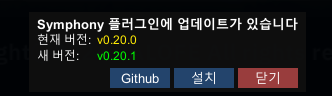

# Symphony
`Symphony` is a [BepInEx](https://github.com/BepInEx/BepInEx) plugin for the PC client of the game `LastOrigin` by `VALOFE`.
Its goal is to provide various quality-of-life (QoL) features for users.

## Installation
1. Download the **BepInEx-Unity.Mono-win-x64** version of [BepInEx](https://github.com/BepInEx/BepInEx) 6 from the [download page](https://github.com/BepInEx/BepInEx/releases/tag/v6.0.0-pre.2).
2. Unzip the downloaded file and paste its contents into the installation folder where `LastOrigin.exe` is located.\
At this point, the `winhttp.dll` file and the `LastOrigin.exe` file must be in the same folder.
3. Place `Symphony.dll` inside the `plugins` folder, which is within the `BepInEx` folder.

## How to Use
You can configure the plugin's options on the game screen by pressing the `F12` key.

The following is a description of each feature within the plugin.

### SimpleTweaks
A collection of various simple quality-of-life improvements for the game.

It provides features to display game FPS, limit FPS, a hotkey to hide the lobby UI, bug patches, and mute audio when the game is in the background.

### WindowedResize
This feature allows you to switch to windowed mode with a set key, after which the window can be resized and maximized. It also remembers the window's last position and size.

The default key for toggling fullscreen/windowed mode is `F11`.

If you need to reset the settings due to issues such as <ins>the window going off-screen</ins>, you can resolve it by deleting the `Last...` values in the configuration file and restarting the game.

### BattleHotkey
Assigns keyboard shortcuts for the `Skill 1`, `Skill 2`, `Move`, `Standby`, `Select Enemy`, `Select Enemy Tile`, `Confirm (after selecting an enemy or tile)`, and `Start Action` buttons in battle.

`Confirm (after selecting an enemy or tile)` works by pressing the key corresponding to the selected enemy or tile a second time.
The numbering for enemies and tiles corresponds to the numpad layout (Enemy `1` is located at the bottom left).

## Updates
If the plugin requires an update, the following message will be displayed when the game starts.

Clicking the `[Github 페이지로 이동]` button will automatically take you to the Releases page of this repository.

## Disclaimer
This is an unofficial mod. By using this mod, you agree that you are solely responsible for any issues or damages that may arise. Always back up your important data before use. The developer assumes no liability for any loss or damage caused by the use of this mod.

## License
The `Symphony` project is under the `LGPL-2.1 license`.
